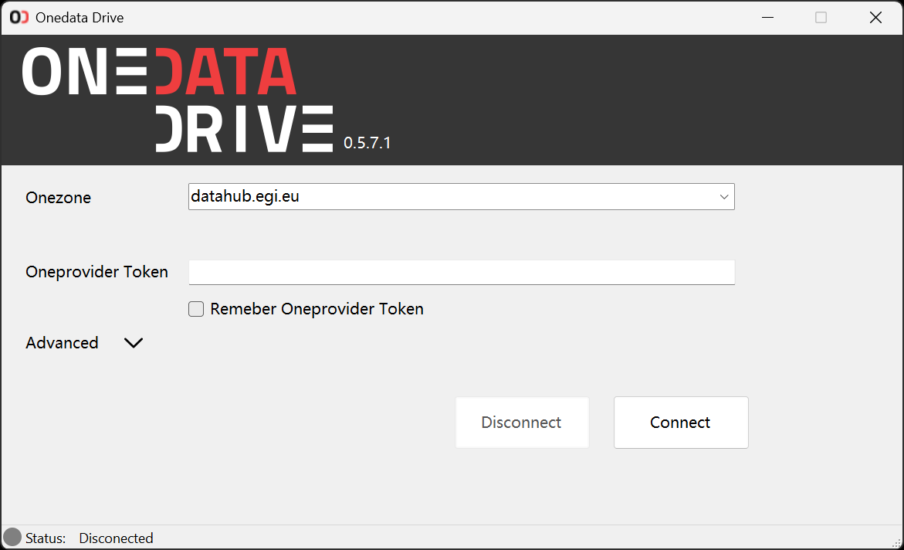
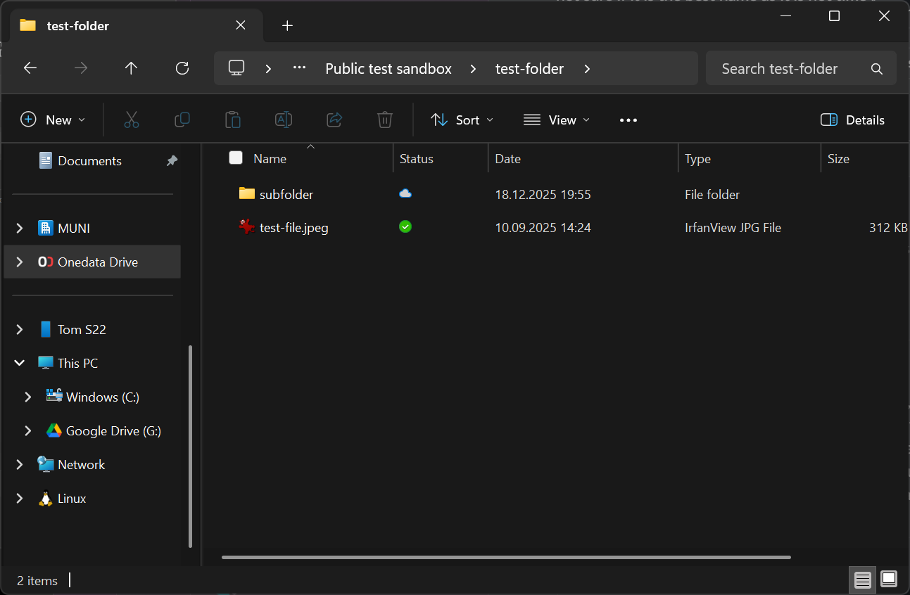
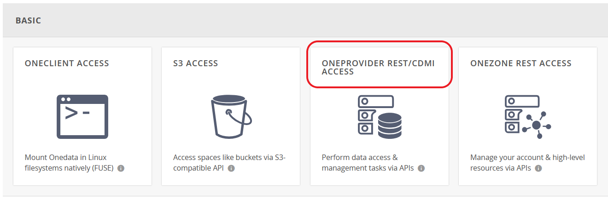

# Onedata Drive

**The application is currently under development. Available installation packages are alpha versions. It is not intended for use with production data!**

**We recommend running the application in `read-only` mode, as concurrent data modifications or unexpected crashes could lead to data corruption.**

<hr>

**Onedata Drive** is a GUI application allowing Windows users to work with data stored in Onedata system. 
<p align="center">
    
</p>

<p align="center">
    
</p>


## Requirements
- Supported Windows version: **Windows 10 (version 1803 +)** and **Windows 11**
- **.NET Desktop Runtime 10**
- Compatible only with **Oneprovider 25.0+**

## Installation
- If you encounter an `untrusted certificate` error during installation, it is likely because your current version of the application was signed using a self-signed certificate.
    - In order to install the unsigned version of the application, you have to install the certificate from the installer.
    - `Properties -> Digital Signatures -> Details -> View Certificate -> Install Certificate -> Local Machine -> Place all certificates in the following store -> Trusted People.`
- Before the installation of the new version, **versions older than 0.5.x should be uninstalled**

## Running the app
- in order to access files Onedata Drive must be running
- every time you restart computer/app and connect again new session is created
- **Oneprovider Token** must have REST/CDMI access
- changes performed on cloud side are synced usually within 60s


### Configuration
In order to run the application you need to fill:
- **Onezone URL** (e.g. `datahub.egi.eu`)
- **Oneprovider token**

### Token creation
1. Go to Onezone web interface and log in with your credentials.
1. Go to `Tokens` and click `Create new token`.
1. From `Basic` select `Oneprovider REST/CDMI access`
1. Hit `Create token`
<p align="center">
    
</p>

### Filling the connect form
All options can be set in the graphical user interface. You can fill the connect form manually or you can load an existing configuration file (`Advanced` -> `Load configuration from file`). 

**Configuration JSON file example:**
```
{
    "onezone" : "datahub.egi.eu",
    "provider_token" : "TOKEN",
    "root_path" : "C:\\Users\\user\\Onedata Drive\\"
}
```

## Application logs
App logs can be accessed in `Advanced` -> `Open folder with logs`

## In case of app failure
- If the app crashes and you can not reconnect to the cloud restarting computer should fix the issue.
- If the app is not connected, but sync root (Onedata folder) is still present you may try using `Advanced -> Remove SyncRoot`

## Notes
- Does not work in Windows Sandbox. In virtual machine (e.g. in Hyper-V) it works fine.
- The develop versions of the application are signed with certificate which is not trusted by default in Windows. 

## Acknowledgment
<p align="left">
  
</p>

---
This project output was developed with financial contributions from the [EOSC CZ](https://www.eosc.cz/projekty/narodni-podpora-pro-eosc) initiative throught the project **National Repository Platform for Research Data** (CZ.02.01.01/00/23_014/0008787) funded by Programme Johannes Amos Comenius (P JAC) of the Ministry of Education, Youth and Sports of the Czech Republic (MEYS).

---

<p align="left">
  
</p>
